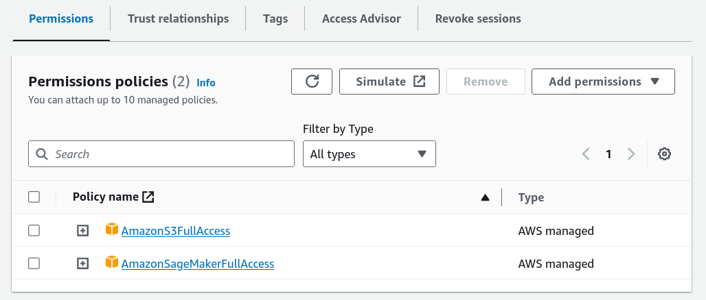
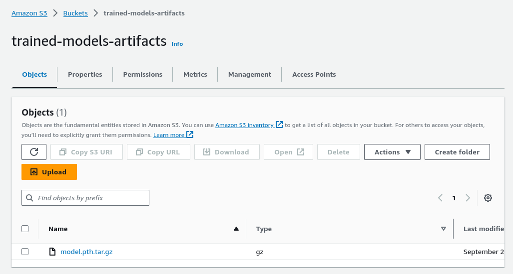
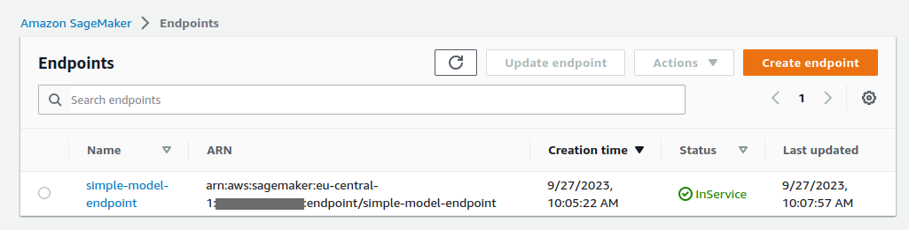

# PyTorch SageMaker Tutorial
This repo provides explanations and example code for deploying PyTorch models in AWS SageMaker. 

Deploying your model may be a bit tiresome (especially after some intense training experiments) but is a necessary step forward to a scalable infrastructure. In the following article we will take a look at a simple recipe to deploy a PyTorch model in AWS SageMaker.

## A toy model
Let's define a simple PyTorch model that we can experiment with.
```doctest
class SimpleModel(torch.nn.Module):
    def __init__(self):
        super(SimpleModel, self).__init__()
        self.fc = torch.nn.Linear(10, 2)

    def forward(self, x):
        x = self.fc(x)
        x = torch.nn.functional.softmax(x, dim=-1)
        return x

def save_model(model: torch.nn.Module, save_path):
    torch.jit.script(model).save(save_path)

def load_model(model_path):
    model = torch.jit.load(model_path)
    return model
```
Functionally, this model acts like any other trained model, even though it returns random values. As a sanity check we can test out that it is saved and loaded correctly:
```doctest
def test_simple_model():
    model = SimpleModel()

    save_model(model, 'test_model.pt')
    model = load_model('test_model.pt')

    input_tensor = torch.rand(10)
    input_batch = input_tensor.unsqueeze(0)
    output_batch = model(input_batch)
    output_tensor = output_batch[0]
    output_array = output_tensor.detach().cpu().numpy()
```

## A little bit on AWS roles and permissions
In the AWS Dashboard we need to define the Role and Permissions the MLflow service will use. 
From the POV of AWS, the calls made by AWS are just like any other calls made by an user, so it needs to know what it is allowed to do and what not.
### A little bit of AWS terminology 😅:
- Role: identity associated with permission policies
- IAM (Identity and Access Management role): controls roles permissions to resources
- ARN (Amazon Resource Name): identifier for a specific resource, as in Role ARN
- Assume Role ARN: allows the service or entity to assume the role and take actions based on the permissions of that role. Essentially, it's an authorization to say, "I trust this entity/service to act as this role."
- Execution Role ARN: refers to the role that the service will assume when it's executing.

In some contexts, Assume and Execution might refer to the same role, especially if the role is created for a specific task. However, in more complex setups, different roles might be used.
These are some good guidelines for defining a valid role: https://docs.aws.amazon.com/sagemaker/latest/dg/sagemaker-roles.html

### Defining a role for the task
There are two obvious operations our script will execute, which require the corresponding permissions (you can choose Full Access for now):
- S3 Access - for the service to push and pull the model
- SageMaker Access - for the service to launch the SageMaker endpoint

This is the Role the deployment operation will assume. However, when pushing the model from our local machine, that operation is executed by the User, therefore the User should also have S3 permissions.

### How the credentials are passed 📫
The credentials management is done pretty neatly by boto3. It checks for a clear set of environment variables, without needing them explicitly passed as parameters. 
In this tutorial, we define them in an .env file:
```doctest
AWS_ACCOUNT_ID=
AWS_ACCESS_KEY_ID=
AWS_SECRET_ACCESS_KEY=
AWS_DEFAULT_REGION=
AWS_ROLE_ARN=
```
Then, at the beginning of the script we load them using dotenv :
```doctest
dotenv.load_dotenv('.env')
```

## Pushing the model to S3 📦
In order to deploy the model in SageMaker, SageMaker needs to be able to access the model. This means the model must be pushed in an S3 bucket.
```doctest
def push_model_to_s3(model_path, bucket_name='trained-models-artifacts'):
    s3 = boto3.client('s3')
    archive_path = compress_model(model_path)
    model_uri = s3.upload_file(
        Filename=archive_path,
        Bucket=bucket_name,
        Key=os.path.basename(archive_path)
    )
    return model_uri
```
Make sure the bucket exists (the creation of a bucket is a different operation). Also, the model needs to be compressed as a tarball (this is specific to how SageMaker will initialize the model). You should get something like this:


## Model helper functions
SageMaker uses several helper functions to manipulate the model (load, pre-process data, predict). These need to be defined in a separate script and the name of the script is given as a parameter to the deploy function. For now, we'll refer to the script as serve.py. These are the functions it must contain:
```doctest
from model.model import load_model
import torch
import os
import json
MODEL_FILE_NAME = 'model.pth'

def model_fn(model_dir):
    model_path = os.path.join(model_dir, MODEL_FILE_NAME)
    model = load_model(model_path)
    device = torch.device("cuda" if torch.cuda.is_available() else "cpu")
    model.to(device)
    return model

def input_fn(request_body, request_content_type):
    if request_content_type == 'application/json':
        data = json.loads(request_body)
        input_tensor = torch.tensor(data)
        return input_tensor
    else:
        raise ValueError(f"Unsupported content type: {request_content_type}")

def predict_fn(input_data, model):
    device = torch.device("cuda" if torch.cuda.is_available() else "cpu")
    with torch.no_grad():
        input_data = input_data.to(device)
        predictions = model(input_data)
    return predictions

def output_fn(prediction, response_content_type):
    if response_content_type == 'application/json':
        return prediction.cpu().numpy().tolist()
    else:
        raise ValueError(f"Unsupported content type: {response_content_type}")
```
As you see these functions act as an interface to the model and any custom functionality should be handled here. It is important to respect the naming conventions as SageMaker imports them from this script and otherwise will not find them.

## Deploy the model 🚀
Functionally, the model is wrapped in a specific module before being sent to SageMaker. In this case, since we are dealing with a PyTorch model, we will use:
```doctest
pytorch_model = sagemaker.pytorch.PyTorchModel(
        model_data=model_uri,
        role=role_arn,
        framework_version=torch_version,
        py_version=py_version,
        entry_point='model/serve.py',
        source_dir='.'
    )
```
The Role is the one the endpoint will assume when executing. Specifying the correct PyTorch and python version is crucial, as in the background, SageMaker launches specific images with the corresponding dependencies.
Finally, deploy the model:

```doctest
pytorch_model.deploy(
        endpoint_name=endpoint_name,
        instance_type=instance_type,
        initial_instance_count=1
    )
```
This will create an endpoint running on one or more identical instances (which is great for handling large volumes of traffic).
In the AWS Dashboard you should see something like this:


## Executing predictions
In order to call the model, you can run:
```doctest
def invoke_sagemaker_endpoint(endpoint_name, input_data):
    runtime = boto3.client('sagemaker-runtime')
    payload = json.dumps(input_data)
    response = runtime.invoke_endpoint(
        EndpointName=endpoint_name,
        ContentType='application/json',
        Body=payload
    )
    result = json.loads(response['Body'].read().decode())
    return result
```

## Conclusion
Hope this helped 🙌